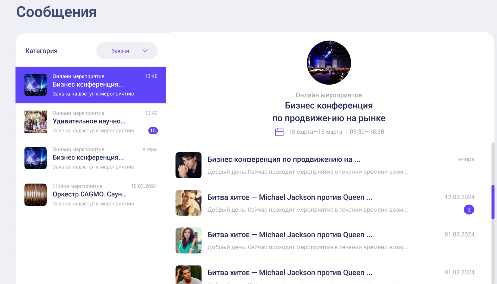

## Документация к вебсокет чату

### События, которые сервер отправляет вам

- chat_updates: обновление сообщений в чате. Присылает весь объект чата. Если _eventOwnerId_ равен вашему id, то этот чат - один из чатов, в которых пользователи пишут вашему мероприятию, соответственно такие чаты должны группироваться по eventId:
  

```json
{
	"chatId": "some_chat_id", // уникальный идентификатор чата
	"event": {
		"id": 10,
		"name": "Event name",
		"iconsUUIDs": ["icon uuid1", "icon uuid2"]
	},
	"eventOwnerId": 14, // id владельца мероприятия
	"isRequestSended": true, // является ли этот чат заявкой на сообщение?
	"messages": [
		// массив новых сообщений чата
		{
			"messageId": 10, // уникальный номер сообщения в чате
			"text": "Привет!"
		}
	]
}
```
