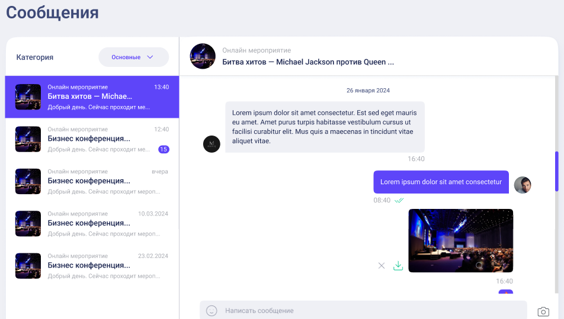
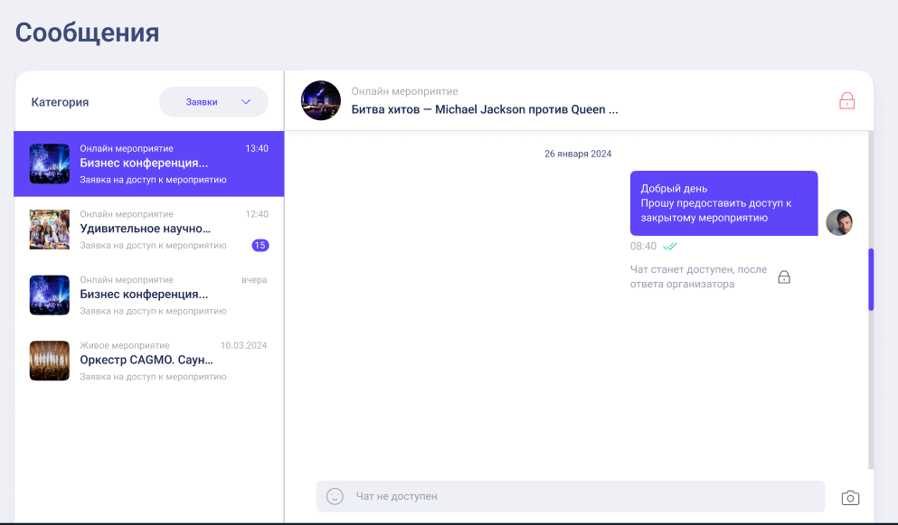
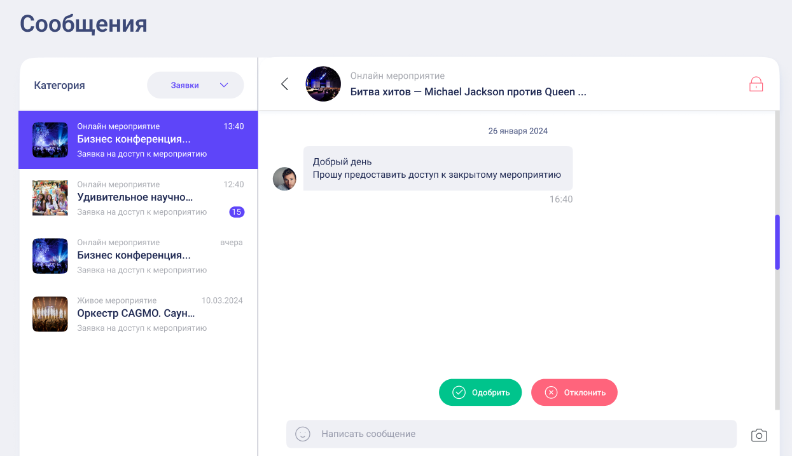

# Документация к вебсокет чату

## События, которые сервер отправляет вам

### initial_data

Приходит сразу после подключения. Содержит все данные чатов.

```json
[
  {
    "event": {
      "id": 10,
      "name": "Event name",
      "iconsUUIDs": ["icon uuid1", "icon uuid2"],
      "location": "ONLINE",
      "dateFromS": 2514131321,
      "dateToS": 1957817098
    },
    "eventOwnerId": 14, // id владельца мероприятия
    "chats": [
      {
        "chatId": "some_chat_id", // уникальный идентификатор чата
        "isRequestSended": true, // является ли этот чат заявкой на мероприятие?
        "isAccessGranted": false, // в случае если мероприятие заявка, выдан ли на нее доступ?
        "user": {
          "id": 1,
          "name": "User 1",
          "imageUUID": "uuid1"
        },
        "messages": [
          // массив новых сообщений чата
          {
            "messageId": 10, // уникальный номер сообщения в чате (начинаются с 1)
            "text": "Привет!",
            "photos": ["uuid1", "uuid2"],
            "date": "2025-03-01T13:51:53.285Z",
            "fromUserId": 14,
            "toUserId": 16
          }
        ],
        "myUnreadCount": 10,
        "interlocutorUnreadCount": 20
      }
    ]
  }
]
```

<!-- ### chat_updates

Присылается при обновлении сообщений в чате в чате. Присылает весь объект чата. Если `eventOwnerId` равен вашему id, то этот чат - один из чатов, в которых пользователи пишут вашему мероприятию, соответственно такие чаты должны группироваться по id мероприятия:


Если `eventOwnerId` не равен вашему id, то этот чат - один из чатов, в который вы, как пользователь, пишите, чтобы например получить доступ к нему:



Параметр `isRequestSended` отвечает за то, является ли чат запросом на мероприятие. Если он является запросом, то со стороны пользователя он выглядит так:



а со стороны владельца вот так:



```json
{
  "chatId": "some_chat_id", // уникальный идентификатор чата
  "event": {
    "id": 10,
    "name": "Event name",
    "iconsUUIDs": ["icon uuid1", "icon uuid2"]
  },
  "eventOwnerId": 14, // id владельца мероприятия
  "isRequestSended": true, // является ли этот чат заявкой на мероприятие?
  "messages": [
    // массив новых сообщений чата
    {
      "messageId": 10, // уникальный номер сообщения в чате (начинаются с 1)
      "text": "Привет!",
      "photos": ["uuid1", "uuid2"],
      "date": "2025-03-01T13:51:53.285Z",
      "fromUserId": 14,
      "toUserId": 16
    }
  ]
}
```

### chat_unread

Обновление статуса просмотров у чата. Показывает как ваши непрочитанные, так и непрочитанные у вашего собеседника.

```json
{
  "chatId": "some_unique_id",
  "myUnreadCount": 10, // количество сообщений, которые я не прочитал
  "interlocutorUnreadCount": 20 // количество моих сообщений, которые не прочитал собеседник
}
```

### history

Загрузка более ранних сообщений чата. Приходит при отправке события `load_history`.

```json
{
  "chatId": "some_unique_id",
  "messages": [
    {
      "messageId": 1,
      "text": "Это старое сообщение",
      "photos": ["uuid1", "uuid2"],
      "date": "2025-03-01T13:51:53.285Z",
      "fromUserId": 14,
      "toUserId": 16
    }
  ]
}
```

### debug_info

Присылает ошибки, чаще всего связанные с неверными входными параметрами на запрос. Или внутренними ошибками сервиса.

## События, которые сервер ожидает от вас

## send_message

Отправка сообщения в чат.

```json
{
  "chatId": "chat_unique_id",
  "message": {
    "text": "Текст сообщения",
    "photos": ["uuid1", "uuid2"],
    "attachedPhotos": ["uuid1", "uuid2", "uuid3"]
  }
}
```

## read_messages

Пометить сообщения как прочитанные

```json
{
  "chatId": "chat_unique_id",
  "lastReadedMessageId": 10 // messageId последнего прочитанного сообщения
}
```

## load_history

Запрос на загрузку диалога выше (истории)

```json
{
  "chatId": "chat_unique_id",
  "lastMessageId": 124 // messageId самого последнего загруженного сообщения в чате
}
``` -->
